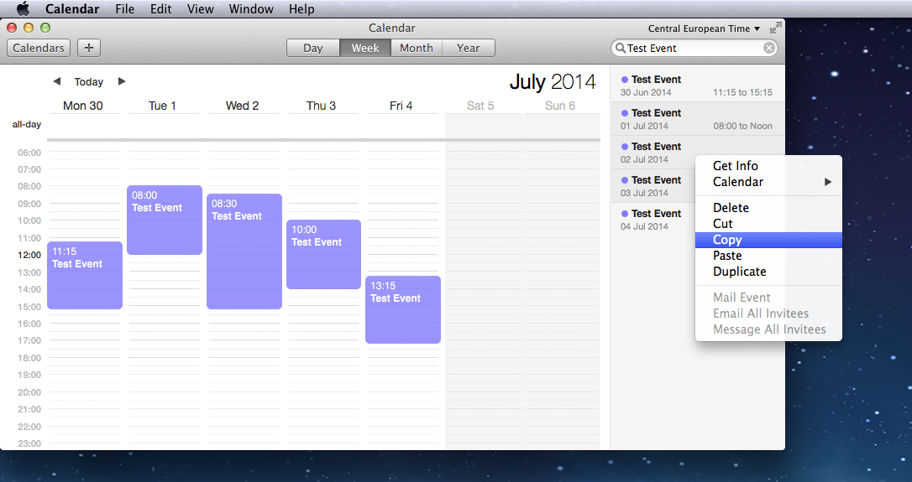

# Calendar.app counter

> Read, parse, count hours/days for a Calendar.app search list result

> [!NOTE]  
> Tested with macOS 26 & Node 22.

Here is a simple script I use to count some hours/days archived in Calendar.app



Doing that you will get something like this in you clip board.

```
Test Event
Scheduled: 03 Jul 2014 10:00 to 14:00

Test Event
Scheduled: 01 Jul 2014 08:00 to 12:00

Test Event
Scheduled: 02 Jul 2014 08:30 to 15:15
```

Also support french locale.

```
Test Event
Dates : 28 avr. 2025 à 11:00-12:30, UTC+2

Test Event
Dates : 29 avr. 2025 à 09:30-14:45, UTC+2

Test Event
Dates : 29 avr. 2025 à 17:15-20:15, UTC+2
```

_Note: You can see that result are not sorted by date, don't ask me why... But don't worry I take care of that._


## Installation

```console
$ git clone https://github.com/MoOx/Calendar.app-counter.git
$ cd Calendar.app-counter
$ npm i
```

## Usage

Do you search, select result you want in the list on the right on `Copy` them.
Then

```console
$ ./parse-calendar.app-clipboard

01 Jul 2014: 4 hours done
02 Jul 2014: 6.75 hours done
03 Jul 2014: 4 hours done


Test Event time report between 01 Jul 2014 to 03 Jul 2014
Total hours: 14.75
Total days : 2.11 (7 hours per day)
```

---

## [License](LICENSE)
